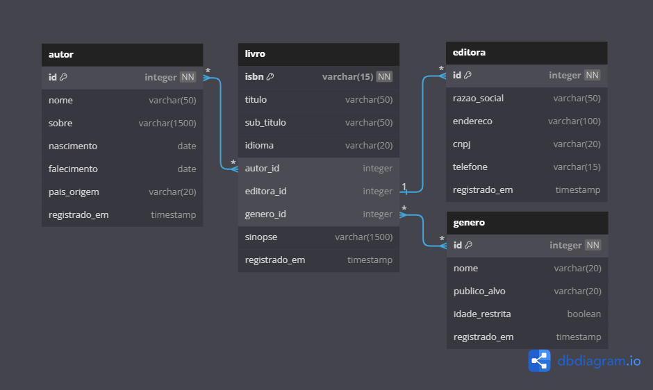
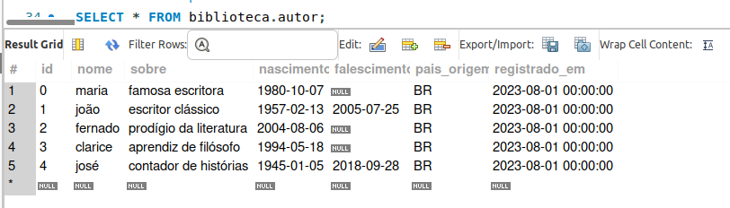

## PROJETO INDIVIDUAL - CDA - MODULO 3

## 🚀 Começando

Uma biblioteca está desenvolvendo um sistema web para armazenar informações sobre seus livros e autores e necessita de um Banco de Dados para usar nesse site. Você foi contratado para construir a modelagem do banco de dados!

## 🛠️ Construído com

* [Dbdiagarm](https://dbdiagram.io)
* [MySQL Workbench](https://www.mysql.com/products/workbench/)

## 🗃️ Como funciona

Link para o modelo do **[Diagrama](https://dbdiagram.io/d/64b545e202bd1c4a5e34e92e)**



Com o diagrama desenvolvido acima, o projeto foi construído no Workbench, com os códigos exemplo abaixo:

Criação do banco de dados e uma de suas tabelas:
```
CREATE DATABASE IF NOT EXISTS biblioteca;
USE biblioteca;

CREATE TABLE IF NOT EXISTS autor(
id INT PRIMARY KEY NOT NULL UNIQUE,
nome VARCHAR(50),
sobre VARCHAR(1500),
nascimento DATE,
falescimento DATE,
pais_origem VARCHAR(20),
registrado_em TIMESTAMP
);
```
Definindo as chaves estrangeiras da tabela livro:
```
ALTER TABLE livro ADD FOREIGN KEY (autor_id) REFERENCES autor (id);
ALTER TABLE livro ADD FOREIGN KEY (editora_id) REFERENCES editora (id);
ALTER TABLE livro ADD FOREIGN KEY (genero_id) REFERENCES genero (id);
```
E populando os registros, por exemplo a tabela autor:
```
INSERT INTO autor (id, nome, sobre, nascimento, falescimento, pais_origem, registrado_em) VALUES
(0,'maria','famosa escritora','1997-06-26',null,'BR','1997-06-26 00:00:00'),
(1,'joão','escritor clássico','1957-06-26','1998-06-26','BR','1997-06-26 00:00:00'),
(2,'josé','novato','1997-06-26',null,'BR','1997-06-26 00:00:00');
```

## 📊 Resultado

Exemplo da tabela autor já com alguns registro:



---
